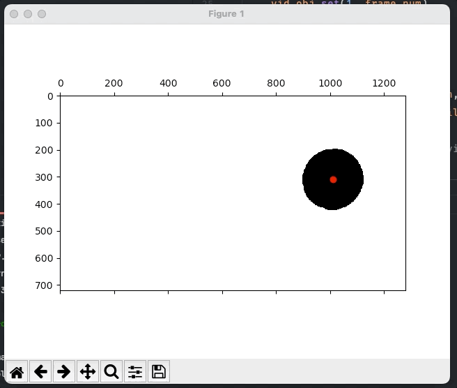
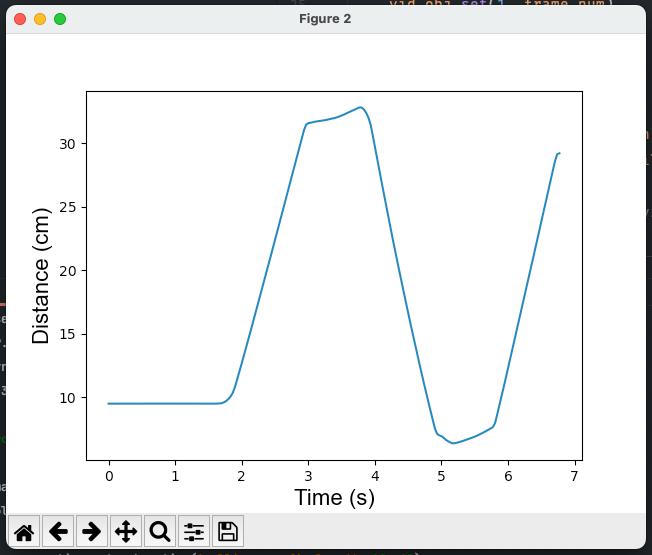

## Intro

This repo contains the python code used in my phys 141 weekly labs at the University of Arizona. 

---

### Lab 1

This lab was simple. Just a familiarization of the student to python. We were asked to create a python file to convert from the user's input temperature in Fahrenheit to Celsius as well as a file that would take two numbers as input from the user and return the sum and product of the numbers. 

---

### Lab 2
Lab for setting up some basic python code that tracks a can of food as it rolls along a surface. The position of the can is plotted on a graph using matplotlib.

### Known issues
An issue I ran into was with the default backend used by matplotlib within the IPython REPL on MacOS. The plot would freeze up and ultimately crash. To fix this I simply had to run the following command in IPython:

```shell
    %matplotlib
```


### Lab details

This works by using some built-in modules in matplotlib, opencv-python, and numpy. 

1. The blue can lid is masked by converting the image to greyscale and setting every rbg value in the image to white except for the can lid. 
2. Using opencv, the center of the taped lid is found as xy coordinates in the overall image
3. The xy coordinates are saved into an array and then plotted on top of the masked label
4. After all the center points have been saved and plotted, the array of all xy pairs are then plotted into a final position graph

__Recorded video:__


__Masked Video:__



__Plot:__




